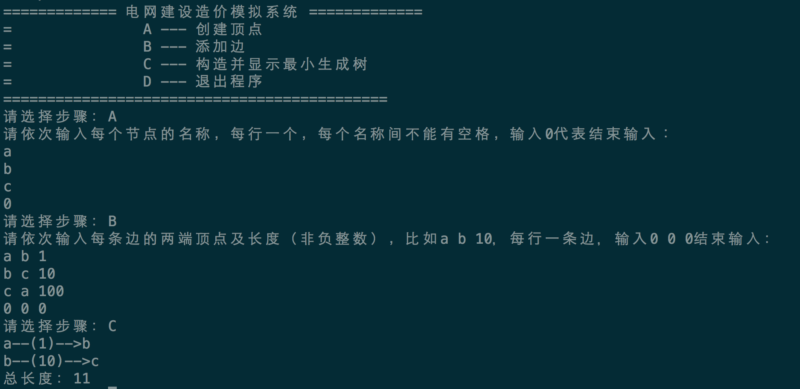
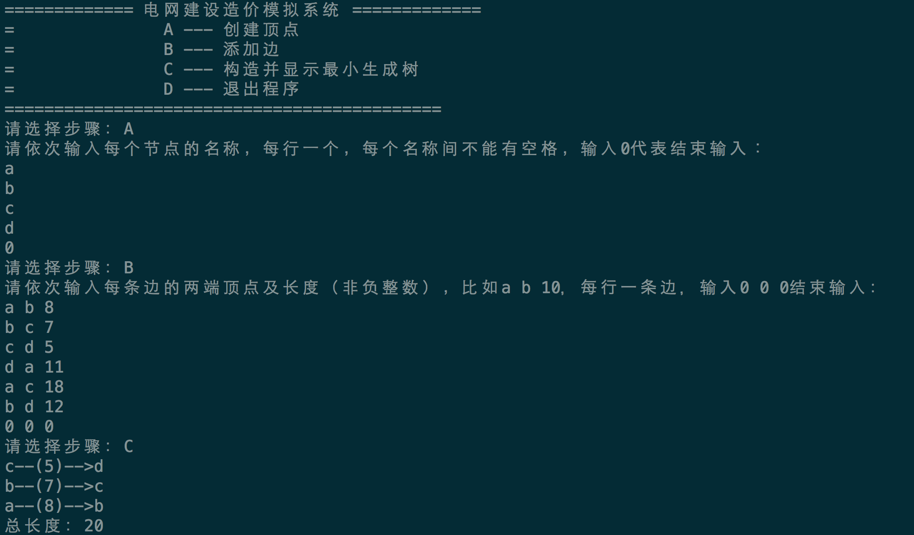

# 电网造价模拟系统
本项目基于Kruskal算法，模拟一个电网最小造价方案的生成。

### 编译
你可以使用**make**生成项目可执行文件，示例：

```bash
make
```

在编译前，你的系统里面需要有可以使用的g++或c++编译器，并且设置了相应的PATH。

### 运行
运行后，程序会显示出使用的方法。通过键入指令的方式，你可以输入电网的数据。下面是两个运行的示例：




如果你采用纯文本方式查看本文档，你可以在同目录下看到demo1.png与demo2.png。

### 算法原理
设无向连通网为G＝(V, E)，令G的最小生成树为T＝(U, TE)，其初态为U＝V，TE＝{ }，然后，按照边的权值由小到大的顺序，考察G的边集E中的各条边。若被考察的边的两个顶点属于T的两个不同的连通分量，则将此边作为最小生成树的边加入到T中，同时把两个连通分量连接为一个连通分量；若被考察边的两个顶点属于同一个连通分量，则舍去此边，以免造成回路，如此下去，当T中的连通分量个数为1时，此连通分量便为G的一棵最小生成树。 

### 作者信息

- 作者：吴迪
- 学号：1253021
- 邮箱：webmaster@leapoahead.com